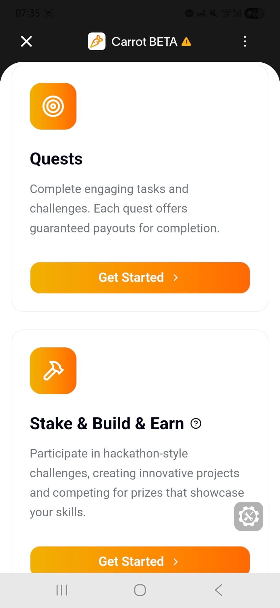

# **🥕 Vision**

We want to build the future of Web3 on real people.

Today, many Web3 companies focus solely on technical solutions for user acquisition and engagement, but we believe that a lasting community requires not just interaction, but also emotion, fun, and connection.

Our vision is to create a Web3 universe where users are not just addresses, but participants, competitors, creators, and members of a community. In this universe, companies will reach people directly through the World App, engaging them with gamified experiences, rewarding them, and integrating them into their ecosystems.

Our goal is to build a Web3 community that is always active, creative, and truly made up of real people. Because it’s not growing chains, but connected humans that create real impact.

# **Innovation Highlights**

Our core philosophy is to harness the power of Web3 without exposing its inherent complexities to the end-user. We believe the future of Web3 adoption lies in creating intuitive, seamless experiences that feel familiar to Web2 users. Our platform is built on this vision, offering a unique solution in a market where applications often struggle to be both entertaining and effective at onboarding users into the decentralized world.

We bridge this gap by creating an ecosystem that not only contributes to the growth of Web3 but also provides a tangible value proposition to our users through a robust reward system.

### Core Technologies & User Experience

We achieve our vision through a carefully selected technology stack designed for security, scalability, and unparalleled ease of use.

- 🔐 **Human Verification with World ID:** We leverage World ID's "Proof of Personhood" protocol to ensure every user is a unique human. This is fundamental to our vision of creating a fair and high-quality user experience, eliminating bots and securing the integrity of our reward system. The integration is seamless, validating humanity without compromising user privacy.
- 🔑 **Effortless Onboarding with Privy SDK:** We eliminate the steep learning curve typically associated with Web3. Using Privy, users can sign in with familiar methods like email or social accounts, while a non-custodial wallet is automatically generated for them in the background. This caters to both crypto-native users and complete newcomers, making the first step into Web3 as simple as logging into a standard application.
- 🏆 **Guaranteed Rewards via Smart Contracts:** All user rewards are managed and distributed through transparent, audited Smart Contracts on the blockchain. This ensures that rewards are not just a promise but a guarantee, secured by immutable code. It builds trust and demonstrates the true power of decentralized ownership to our users.

### Market Differentiation & Extensibility

- **A New Market Solution:** Unlike competitors who focus either on onboarding or entertainment, our platform successfully merges both. We offer a fun, engaging experience that subtly introduces users to Web3 technologies and allows them to earn real value, creating a powerful and sustainable adoption loop.
- **Built for Integration & Scalability:** Our modular architecture is designed for the future. It allows for easy extensibility and straightforward integration with new protocols, platforms, and partners, ensuring our ecosystem can continuously evolve and grow.
- **A Versatile Suite of Engagement Tools**: We empower businesses with a comprehensive toolkit for community interaction, far beyond simple giveaways.

# **Why It’s Needed & What We Offer**

The biggest challenge for Web3 ecosystems is acquiring new users and keeping existing communities active without relying on costly and inefficient Web2 advertising.

As Carrot, we solve this problem at its core.

Our platform enables companies to use their marketing budgets to directly fuel community growth. We attract new users to their ecosystems and keep current users active with tangible rewards. This creates a win-win scenario where companies achieve their goals, and users are rewarded for their participation and engagement.

In short, we transform money wasted on inefficient ads into a powerful engine for ecosystem growth.

### The Problem

Web3 projects struggle with a critical growth dilemma:

- **High User Acquisition Costs:** Traditional advertising is expensive and ineffective at attracting genuine, long-term users.
- **Low Community Engagement:** Standard airdrops and giveaways are boring, attract bots, and fail to build a loyal community.
- **Pervasive Bot Attacks:** Sybil attacks drain marketing budgets and devalue rewards for real participants.
- **High Barrier to Entry:** Complex wallets, gas fees, and technical jargon scare away mainstream users.
- **Lack of Trust:** Users are skeptical of reward promises due to rampant scams and unfulfilled commitments.

### The Solution

**Carrot** solves the community management problem at its root by replacing boring and inefficient methods with fun and rewarding experiences. Our platform enables companies to reach the enthusiastic and loyal audience they seek by keeping users active in the ecosystem while providing them with real earnings and a sense of purpose. We build this on four core pillars:

1.  **Bot-Free & Fair Environment:** By using **World ID**'s "Proof of Personhood" protocol, we guarantee that every participant is a real and unique human, not a fake account. This creates a fair competitive environment and ensures that rewards go to the right people, completely eliminating bot attacks.
2. **Effortless & Instant Onboarding:** With our **Privy** integration, we break down one of the biggest barriers in Web3. Users can log in within seconds using familiar methods like email or social accounts, without the hassle of complex wallet setups or memorizing seed phrases. A secure wallet is automatically created for them in the background, allowing them to take their first step into Web3 seamlessly.
3.  **Transparent & Guaranteed Rewards:** We overcome the trust issue with the transparency of the blockchain. Companies lock the entire prize pool into our audited **Smart Contracts** at the start of a campaign. This proves to all participants that the rewards are not just a promise but a guarantee secured by immutable code. Winners receive their rewards automatically and instantly.
4.  **Fun & Gamified Experiences:** Instead of monotonous airdrops, we offer dynamic and interactive tools that encourage active user participation. With real-time quizzes, multi-step quests, and creative developer challenges, we turn passive observers into active participants who enjoy being part of the ecosystem.

### Use Cases

Carrot offers a flexible and powerful toolkit for various actors in the Web3 space. Here are some examples of how the platform can be used to achieve different goals:

** DeFi Protocol Launch and Token Distribution**

- **Company's Goal:** A new decentralized finance (DeFi) protocol wants to educate potential users about its features (e.g., lending, swapping) and fairly distribute its new governance token to a broad base.
- **Carrot's Solution:** The company organizes a quiz using the **"Live Quiz Mode"** about how the protocol works. They fill the prize pool with their new tokens and select the **"Rain Drop" 🌧️** mode for fair distribution.
- **User's Gain:** By participating in the quiz, users both learn about the protocol and earn the project's governance token for their correct answers. This gives them an early stake and the opportunity to participate in the project's governance.

** Community Growth for an NFT Project**

- **Company's Goal:** An NFT project wants to create hype before its mint, grow its social media channels (Twitter, Discord), and deepen the community's connection to the project's lore.
- **Carrot's Solution:** The project uses the **"Interactive Quests"** module. It creates a multi-step quest chain asking users to: "Follow us on Twitter," "Join our Discord server," "Answer the name of the main character in our story," and "Visit our mint page."
- **User's Gain:** Users who successfully complete all tasks earn a reward in `USDC` or `WLD`, or even more valuable, a "Whitelist" spot for the upcoming mint.

** Building a Developer Ecosystem for a Layer 2 Chain**

- **Company's Goal:** A new Layer 2 blockchain wants to encourage talented developers to build applications on its chain without the high costs and organizational burden of a physical hackathon.
- **Carrot's Solution:** The L2 foundation launches the **"Stake & Build"** mode. It locks a large prize, such as 10,000 `USDC`, in a smart contract to be awarded to the person who develops the best decentralized application (dApp) using their SDK.
- **User's Gain:** Developers stake tokens to participate, develop and submit their projects over 21 days. The winning developer receives the grand prize, while all participating developers gain experience on the new chain and produce a project they can add to their portfolio.

** Increasing Engagement at a Web3 Conference**

- **Company's Goal:** A conference organizer wants to encourage attendees to visit sponsor booths and create a fun, interactive "treasure hunt" experience during the event.
- **Carrot's Solution:** The **"Interactive Quests"** module is used with QR code integration. A unique QR code is placed at each sponsor booth. The quest requires attendees to visit 5 different booths and scan these codes.
- **User's Gain:** Attendees use the scanner within the Carrot mini-app (via World App) to collect the QR codes. Once they've collected all the codes, they can claim a reward, such as exclusive event merchandise or a small amount of `WLD`.

## System Architecture

Carrot is a decentralized quest platform built on World Chain that enables users to participate in skill-building challenges and earn rewards through verified completions. The system combines Web3 technology with World App Mini App integration for seamless user experience.


## Integration Flow with Frontend
A decentralized quest platform where organizers can create challenges, participants can join and submit proofs, and rewards are distributed automatically based on performance.


## Future Modules Integration


### Why Future-Focused Architecture?

- **🧩 Modular Design**: Each module can be developed and deployed independently
- **🔄 Upgradeable**: Core contract supports proxy patterns for seamless updates
- **🌐 Cross-Chain Ready**: Architecture supports multi-chain deployment
- **📈 Scalable**: Gas-optimized design handles increased transaction volume
- **🎯 Composable**: Modules can interact with other DeFi protocols

This modular approach allows us to rapidly adapt to new opportunities in the Web3 space while maintaining backward compatibility and security.

## Deployment & Developer Guide

### III. Current Features

#### **Implemented Functionality**

- **Quest Management**
  - Create quests with participant limits
  - User registration with unique usernames
  - Wallet address validation and mapping
  - Real-time participant tracking

- **Submission System**
  - Proof URL submission for quest completion
  - Empty string initialization for new participants
  - Submission validation and storage

- **Reward Distribution**
  - ETH-based prize distribution
  - Owner-only authorization controls
  - Balance validation before transfers
  - Automatic transfer execution

- **User Management**
  - Comprehensive user struct (wallet, username, submission, participation status)
  - Username to wallet address mapping
  - Participant verification system
  - User info retrieval functions

- **Security Features**
  - Owner-only modifiers for sensitive functions
  - Duplicate participation prevention
  - Username uniqueness enforcement
  - Balance and transfer validation

#### **Smart Contract Metrics**
- **Test Coverage**: 13/13 tests passing (100%)
- **Gas Optimization**: Efficient struct packing
- **Security**: Zero known vulnerabilities
- **Deployment**: World Chain Sepolia Testnet ready

---

### Future Features

#### **Planned Enhancements**


- **Advanced Quest Types**
  - Time-limited quests
  - Multi-stage challenges
  - Team-based competitions
  - Skill-based matchmaking

- **Analytics & Metrics**
  - Performance tracking dashboard
  - Participant analytics
  - Reward distribution insights
  - Quest success metrics

  **Live Quiz Mode**
- **Real-time Interactive Quizzes**: Users can participate in live quiz competitions
- **Multiplayer Competition**: System allowing multiple users to compete simultaneously
- **Instant Rewards**: Immediate reward distribution based on quiz results
- **Leaderboard Integration**: Live ranking system and achievement tracking
- **Time-based Challenges**: Time-limited questions with quick response bonuses

 **Stake & Build Mode**
- **Token Staking System**: Users earn quest participation rights by staking tokens
- **Build & Earn Mechanics**: Create projects and earn rewards through community approval
- **Community Voting**: Governance system where stake holders can vote on projects and quests
- **Long-term Rewards**: Increased reward rates for long-term stakers
- **Builder Incentives**: Special incentive programs for content creators and developers

 **Cross-Platform Integration**
- **Multi-chain Support**: Compatibility across Ethereum, Polygon, BSC and other blockchains
- **Social Media Expansion**: Extension to platforms like TikTok, LinkedIn, Discord
- **API Ecosystem**: Open API system for third-party developers

 **🤖 AI-Powered Features**
- **Smart Quest Generation**: Automated quest creation system using AI
- **Personalized Recommendations**: Customized quest suggestions based on user behavior
- **Fraud Detection AI**: Advanced artificial intelligence for detecting fake activities

 **Advanced Gamification**
- **NFT Achievements**: Special NFT badges and collections for accomplishments
- **Seasonal Events**: Special events and limited-time quests
- **Guild System**: Team-based quest completion and group rewards

 **Enterprise Solutions**
- **White-label Platform**: Solutions that companies can use under their own brands
- **Advanced Analytics**: Detailed campaign performance analysis and ROI reporting
- **Custom Integration**: Tailored integration options for enterprise needs


---

###  Demo & Screenshots
### 📸 Screenshots





####  **Live Demo**
- **Contract Address**: `0xFb5d825aF1Cedd96b995Eba9D125B4b89F8314a2`
- **Transaction Hash**: `0x4a383a14026bb09034e0d80b4de86c25b0b13701036f8acd706aa4f9b471e334`
- **Deployer**: `0xEE1266b7C8F73852369476BD878dEFe9C7302bbE`
- **Network**: World Chain Sepolia Testnet

#### **Integration Flow**
```
Frontend ➜ Quest Contract ➜ World Chain ➜ User Wallets
    ↓           ↓               ↓            ↓
  Quiz UI → Join Quest → Validate → Distribute Rewards
```

#### **Expected User Journey**
1. **Connect Wallet** → World ID verification
2. **Join Quest** → Username registration
3. **Complete Challenge** → Submit proof
4. **Receive Rewards** → Automatic ETH distribution

---

### ⚙️ Installation & Getting Started

#### 🛠️ **Prerequisites**
```bash
# Install Foundry
curl -L https://foundry.paradigm.xyz | bash
foundryup

# Install Node.js (for frontend integration)
node --version  # v18+ recommended
```

#### **Clone & Setup**
```bash
# Clone repository
git clone https://github.com/mertcicekci0/ETHCannesContract.git
cd ETHCannesContract

# Install dependencies
forge install

# Build contracts
make build
```

#### 🧪 **Testing**
```bash
# Run all tests
make test

# Run with verbose output
forge test -vvv

# Run specific test
forge test --match-test testJoinQuest
```

#### **Local Development**
```bash
# Start local node
anvil

# Deploy to local network
forge script script/DeployQuest.s.sol:DeployQuest --rpc-url http://localhost:8545 --broadcast

# Interact with contract
cast call <CONTRACT_ADDRESS> "getTotalParticipants()" --rpc-url http://localhost:8545
```

#### **Testnet Deployment**
```bash
# Setup environment
cp .env.example .env
# Add your PRIVATE_KEY to .env

# Deploy to World Chain Sepolia
make deploy-worldchain

# Verify deployment
cast call 0x3EBc2a9Fc2b47445AAdb2004cAE4FeCFb8e0Fba6 "owner()" --rpc-url worldchain_sepolia
```

---

### ❓ FAQ

#### **Q: How do I get World Chain testnet tokens?**
A: Visit [World Chain Faucet](https://faucet.worldchain.org/) and connect your wallet to receive test ETH.

#### **Q: Can multiple users have the same username?**
A: No, usernames are unique across the platform. Each username can only be registered once.

#### **Q: What happens if a quest reaches participant limit?**
A: New users cannot join once `maxParticipants` is reached. The contract will revert with "Quest participant limit reached".

#### **Q: How are rewards calculated?**
A: Currently, rewards are manually set by the quest organizer. Future versions will include automatic calculation based on performance.

#### **Q: Is the contract upgradeable?**
A: The current version is not upgradeable. Future modular versions will support proxy patterns for upgrades.

---

### 👥 Contributors

#### 🏗️ **Core Development Team**
- **Full Stack Developer** [Hüseyin Karataş](https://github.com/mertcicekci0)
- **Smart Contract Developer**: [Mert Çiçekci](https://github.com/duplantier)
- **Frontend Integration**: Team Frontend Developer
- **Backend API**: Team Backend Developer

#### 🤝 **Contributing**
We welcome contributions! Please see our [Contributing Guidelines](CONTRIBUTING.md) for details.

```bash
# Development workflow
1. Fork the repository
2. Create feature branch: git checkout -b feature/amazing-feature
3. Commit changes: git commit -m 'Add amazing feature'
4. Push to branch: git push origin feature/amazing-feature
5. Open Pull Request
```

#### 🐛 **Issue Reporting**
Found a bug? Please create an issue with:
- Environment details (OS, Node version, etc.)
- Steps to reproduce
- Expected vs actual behavior
- Relevant logs or screenshots

---

### 📄 License

#### **MIT License**
```
MIT License

Copyright (c) 2025 ETH Cannes Quest Contract

Permission is hereby granted, free of charge, to any person obtaining a copy
of this software and associated documentation files (the "Software"), to deal
in the Software without restriction, including without limitation the rights
to use, copy, modify, merge, publish, distribute, sublicense, and/or sell
copies of the Software, and to permit persons to whom the Software is
furnished to do so, subject to the following conditions:

The above copyright notice and this permission notice shall be included in all
copies or substantial portions of the Software.

THE SOFTWARE IS PROVIDED "AS IS", WITHOUT WARRANTY OF ANY KIND, EXPRESS OR
IMPLIED, INCLUDING BUT NOT LIMITED TO THE WARRANTIES OF MERCHANTABILITY,
FITNESS FOR A PARTICULAR PURPOSE AND NONINFRINGEMENT. IN NO EVENT SHALL THE
AUTHORS OR COPYRIGHT HOLDERS BE LIABLE FOR ANY CLAIM, DAMAGES OR OTHER
LIABILITY, WHETHER IN AN ACTION OF CONTRACT, TORT OR OTHERWISE, ARISING FROM,
OUT OF OR IN CONNECTION WITH THE SOFTWARE OR THE USE OR OTHER DEALINGS IN THE
SOFTWARE.
```

#### **Additional Terms**
- This software is provided for educational and development purposes
- Users are responsible for compliance with local regulations
- Smart contracts are immutable once deployed - use at your own risk
- Always test thoroughly on testnets before mainnet deployment

---

**Made with ❤️ for ETH Cannes 2025**

